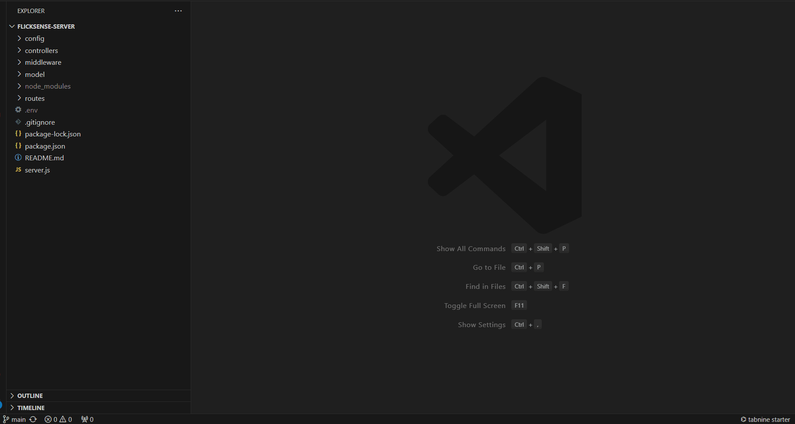
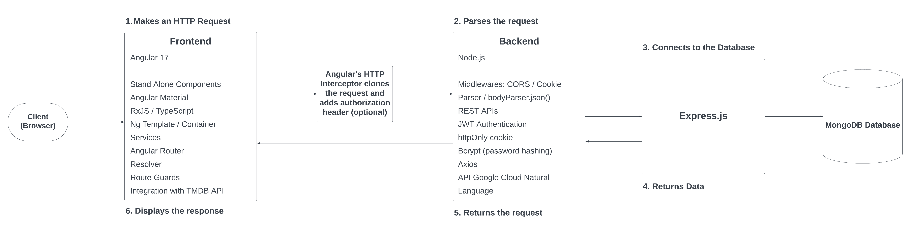

# Using Tabnine an AI-powered tool to develop FlickSense, a MEAN Stack Web Application

[](https://www.tabnine.com)[](https://www.mongodb.com/)[](https://expressjs.com/)[](https://angular.io/)[](https://nodejs.org/) 

## **Introduction**

The purpose of this article is to share my experience using Tabnine, an AI-powered code completion tool while developing a personal MEAN stack project which I called FlickSense. I'll be focusing on the following topics:

1. Tabnine's Overview;
2. Benefits;
3. My Thoughts Using It (+ Amazing Chat Shortcuts)
4. Concluding Thoughts;
5. References.

## **1. Tabnine's Overview**
Tabnine is an AI-powered code completion tool that enhances software development efficiency by providing real-time, context-aware coding suggestions across a wide range of programming languages. It integrates with many popular IDEs and code editors, offering features like code snippets and customizable settings to match individual coding styles. Tabnine prioritizes privacy with options for local processing, making it a secure choice for developers concerned about code privacy. Overall, Tabnine aims to streamline the coding process, allowing developers to focus on solving complex problems more effectively. 

If your curious, "local processing" means that the developer can choose to set Tabnine's Model Serving Mode to Local, Hybrid(Recommended) or Cloud and they also state on their website that:
<br>

 >Although we recommend keeping the hybrid model enabled, you can easily switch to cloud or local mode at any time. Just visit the Tabnine Hub to change the default configuration.

 <br>

<p align="center">
  
  <br>
  <em> Tabnine Hub on VS Code</em>
</p>

>Tabnine continues to place the highest value on your privacy, never storing nor sharing any of your code. All communication with the cloud is strongly encrypted.

## **2. Benefits**
Key benefits include increased productivity through faster coding, reduced errors, valuable learning aid for new team members as it can explain blocks of code, help in writting unit tests and the paid version can go even further depending on the option you choose (Pro/Enterprise) with the Enterprise one being able to provide Al chat agents personalized to your entire codebase, also provide Al models aware of your corporate standards and guidelines, integration with JIRA/Confluence and much more! You can click [here](https://www.tabnine.com/pricing) to get more details on the different pricing and features for each tier available!

In case you want to give Tabnine a try, you can stall the Basic (free) version on your preferred IDE from [here](https://www.tabnine.com/install).

# **3. My Thoughts Using It (+ Amazing Chat Shortcuts)**

I installed Tabnine Basic (free) version on my VS Code IDE to try it out and I wanted to experiment how it would help me. So I started working on a personal MEAN Stack Web Application project called FlickSense. To add context to that, this web app collects the user's review about a particular movie and provides a sentiment analysis indicating if the user's review was happy, neutral or sad. To do that, the application integrates 3rd party API's such as TMDB (The Movie Database) for listing movies and Google Cloud Natural Language for analysing user's review sentiment, provides feedback on it and as a result, it highlights the movie with a green, gray or red border respectively.

Here's a simple diagram illustrating the structure of the project, along with a brief overview of the technologies used.


<p align="center">
  <em>MEAN Stack Architechure Diagram - Reference Source: <a href="https://www.hostingsewa.com/blog/what-is-mean-stack-development-architecture">HostinSewa Blog</a></em>
</p>

<br>

And here are some screenshots of how it is looking like at the moment:

<br>

#### Login


<br>

#### Home Page


<br>

#### Filtering


<br>

#### Sentiment Analysis


<br>

I'll be adding a demo of it in the near future so stay tuned!

<br>

Now, getting back to our main focus here which is using GenAI on the code base, from what I've experimented with Tabnine so far, it is pretty good in auto completing code and its suggestions get even more precise when you already have a solid code base for it to work on top of. So as my code base gets bigger, the suggestions will start to better align with the context I'm working on. However, I already got a few things to share.

This for example, is a quick gif I recorded showing Tabnine's auto-completion in action while adding an API call to update the movie sentiment:

[](https://gifyu.com/image/SCeJE)
<br>

If you work with RxJS, you might have seen that some signatures of the RxJs `subscribe` are deprecated. For example:

<br>

```javascript
// Deprecated:
this.myService.add(this.user.id).subscribe(
  (response) => {
    console.log(response);
  },
  (error) => {
    console.log(error);
  }
);
```

<br>

```javascript
// New way of using it:
this.myService.add(this.user.id).subscribe({
  next: (response) => {
    console.log(response);
  },
  error: (error) => console.error(error),
});
```

<br>

I love that Tabnine sugests the new `subscribe` syntax as you can spot on the gif above. You can read more on this deprecation suject [here](https://rxjs.dev/deprecations/subscribe-arguments).

<br>

In this other example, I got a squiggly line error when declaring Angular's reactive `FormGroup`. I noticed under `Quick Fix` that the option `Fix with Tabnine` appeared

<br>

<p align="center">
  
</p>

<br>

And once I clicked it, the `TABNINE AI: CHAT` opened up in the left side panel showing me how to fix this line.
<br>
<p align="center">
  
</p>

<br>

After applying it's suggestion, the squiggly error line went away.

<p align="center">
  
</p>

Oh and the auto-complete feature is a big help but it can sometimes lead us down the wrong path. For instance, I was working on HTTP requests in an Angular Service and got a suggestion to import `Http` from `@angular/http`. Since this package is deprecated, it triggered an error. So after clicking `Fix with Tabnine`, I hoped for the right import suggestion, which it eventually provided, but only after recommending the installation of the deprecated package and importing `HttpClientModule`, which is not the case here since this module should be provided in the root module `app.module.ts` for non standalone components and inside `app.config.ts` as `provideHttpClient(withInterceptors([authInterceptor])),` for standalone components. It would also be great if it could recognize that `@angular/common` package is already installed by default with Angular CLI projects, so no need to install any package here. So basically the suggestion I was aiming for was to import `HttpClient` from `@angular/common/http`, so it didn't help much here, but as I mentioned before, it might be due to the fact that my project size is not that big for it to get more detailed context and I'm also using the free version here, so I can't expect it to go "above and beyond", but still, as developers, it's crucial we stay vigilant with these suggestions to ensure they align with our requirement needs.

<br>


<br>

Now, speaking about chat, Tabnine provides some easy shortcuts for you to interact with its AI CHAT by placing a section right on top of your code blocks as you can see in the image below:

<br>


<br>

That's why it can significantly ease the onboarding process for new developers. By clicking 'explain', devs can quickly grasp how each block works! For instance, when I requested an explanation for the `shouldShowEllipsis` function, it provided a clear explanation in just a few seconds:

<br>


<br>

It can also streamline the unit testing process with a single click on the `tabnine: test` option. What's particularly interesting here is that it recognizes Angular CLI's default use of Jasmine for testing, and accordingly, it generated a test case example using it, which is pretty neat! &#11088;

<br>


<br>

And it can even get a particular code block documented using `JSDoc`


<br>

Finally, if you click `ask`, it opens up a prompt at the top for you to type your question:

<br>


<br>

After typing your question and hitting `Enter`, it opens up the chat and gives you the answer:

<br>


You can go creative here and it will try to answer to the best of its knowledge and also relying on your code base! If you want to check out more details about Tabnine's Chat, check out this really cool article [here](https://www.tabnine.com/blog/say-hello-to-tabnine-chat/) 

<br>

# **4. Concluding Thoughts**
Tabnine has transformed my coding process, using it on my personal project was a blast! The way it offers instant code suggestions, like automatically providing the subscribe syntax, was incredibly useful. It's also quite impressive how it anticipates the services or endpoints I might need and even though there were a few misses in its suggestions—likely due to the limitations of the free version and the small size of my code base—the accuracy was remarkable most of the time and it even picked up on using Jasmine for my unit tests, setting up all the necessary boilerplate needed which I was quite impressed. The experience with the free version alone has been great, making me curious about the capabilities of the Pro and Enterprise versions as they likely offer even more ways to streamline the Software Development Lifecycle on commercial projects with a big code base and a lot of APIs, repos and documentation for it to act upon. So yes, it's definitely worth checking out and as developers, we should always keep in mind that we need to analyze its suggestions to ensure they meet our requirements and make this a win-win situation for both developers and the overall project.

# **5. References**
- Tabnine documentation - [Tabnine Official Docs](https://www.tabnine.com/docs)
- HostingSewa MEAN Architeture - [Hosting Sewa Blog](https://www.hostingsewa.com/blog/what-is-mean-stack-development-architecture)
- Tabnine Pricing - [Tabnine Pricing](https://www.tabnine.com/pricing)
- JSDoc guide - [Use JSDoc](https://jsdoc.app/)
- Angular documentation - [Angular.io](https://angular.io/docs)
- RxJS deprecations - [RxJS Deprecations](https://rxjs.dev/deprecations/subscribe-arguments)
- Tabnine Chat Introduction - [Say Hello to Tabnine Chat](https://www.tabnine.com/blog/say-hello-to-tabnine-chat/)

